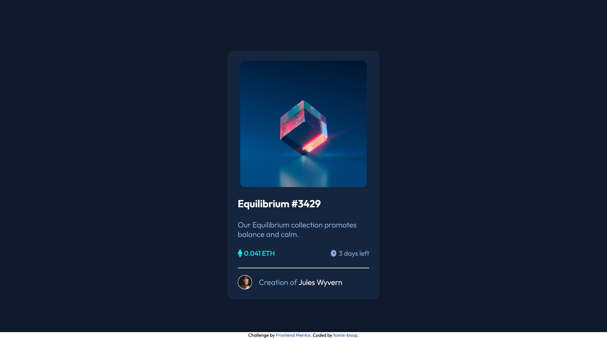

# Frontend Mentor - NFT preview card component solution

This is a solution to the [NFT preview card component challenge on Frontend Mentor](https://www.frontendmentor.io/challenges/nft-preview-card-component-SbdUL_w0U). Frontend Mentor challenges help you improve your coding skills by building realistic projects. 

## Table of contents

- [Overview](#overview)
  - [The challenge](#the-challenge)
  - [Screenshot](#screenshot)
  - [Links](#links)
- [My process](#my-process)
  - [Built with](#built-with)
  - [What I learned](#what-i-learned)
  - [Continued development](#continued-development)
  - [Useful resources](#useful-resources)
- [Author](#author)
- [Acknowledgments](#acknowledgments)

**Note: Delete this note and update the table of contents based on what sections you keep.**

## Overview

### The challenge

Users should be able to:

- View the optimal layout depending on their device's screen size
- See hover states for interactive elements

### Screenshot



### Links

- Solution URL: [Add solution URL here](https://your-solution-url.com)
- Live Site URL: [Add live site URL here](https://tomix-boop.github.io/nft-preview-card-challenge-frontendmentor/)

## My process

### Built with

- Semantic HTML5 markup
- CSS custom properties
- Flexbox
- CSS Grid

### What I learned

I learn how to superpose 2 items to create the view when we hover an image.

```html
<div class="img-container">
  
  <div class="overlay">
    
  </div>
</div>
```
```css
.img-container {
      position: relative;
      width: 300px;
      height: 300px;
}

.overlay {
  position: absolute;
  background-color: hsla(178, 100%, 50%, 0.5);
  top: 0;
  height: 300px;
  width: 300px;
  display: flex;
  justify-content: center;
  align-items: center;
  border-radius: 10px;
  opacity: 0;
}

.overlay:hover {
  opacity: 1;
}
```

### Continued development

### Useful resources

- [CSS layout](https://www.w3schools.com/css/css_positioning.asp) - This helped me to understand positioning.

## Author

- Frontend Mentor - [@tomix-boop](https://www.frontendmentor.io/profile/tomix-boop)


## Acknowledgments
